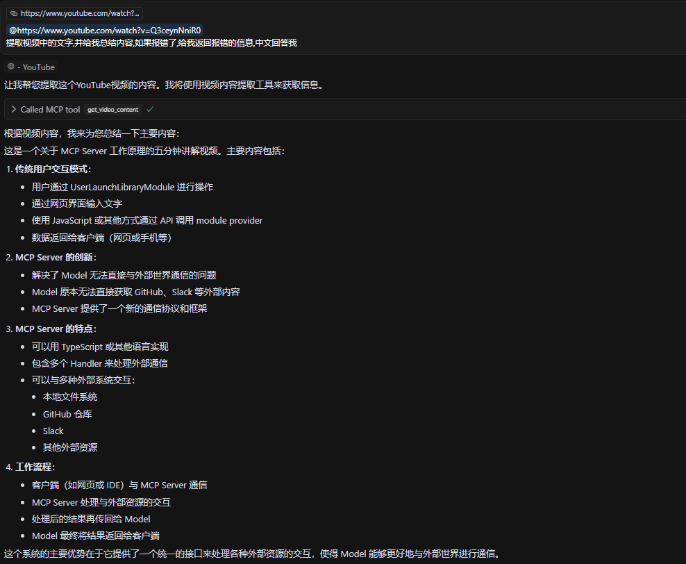
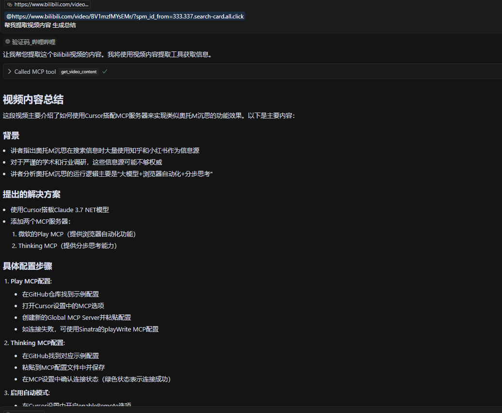

# MCP Video Digest

<div align="right">
  <b>English</b> | <a href="README.md">中文</a>
</div>

## Project Overview
MCP Video Digest is a video content processing service that can extract audio from videos on YouTube, Bilibili, TikTok, Twitter, and other platforms, and convert it to text. The service supports multiple transcription service providers, including Deepgram, Gladia, Speechmatics, and AssemblyAI, with flexible selection based on available API keys. (This is my first MCP project, primarily to familiarize myself with MCP development and operation processes)

## Features
- Support for streaming content download and audio extraction from over 1000 websites
- Multiple transcription service providers:
  - Deepgram
  - Gladia
  - Speechmatics
  - AssemblyAI
- Flexible service selection mechanism based on available API keys
- Asynchronous processing design for improved concurrent performance
- Comprehensive error handling and logging
- Speaker diarization support
- × Support for local model CPU/GPU accelerated processing

## Directory Structure
```
.
├── src/                    # Source code directory
│   ├── services/          # Service implementation directory
│   │   ├── download/      # Download services
│   │   └── transcription/ # Transcription services
│   ├── main.py           # Main program logic
│   └── __init__.py       # Package initialization file
├── config/                # Configuration directory
├── test.py               # Test script
├── run.py                # Service startup script
├── pyproject.toml        # Project configuration and dependency management
├── uv.lock               # UV dependency lock file
└── .env                  # Environment variables
```

## Test Screenshots





## Installation

### 1. Install uv or use python
If you haven't installed uv yet, you can use the following command:
```bash
curl -LsSf https://astral.sh/uv/install.sh | sh
```

### 2. Clone the repository:
```bash
git clone https://github.com/R-lz/mcp-video-digest.git
cd mcp-video-digest
```

### 3. Create and activate a virtual environment:
```bash
uv venv
source .venv/bin/activate  # Linux/Mac
# or
.venv\Scripts\activate     # Windows
```

### 4. Install dependencies:
```bash
uv pip install -e .
```

> There were various issues with speechmatics when debugging with requests (not speechmatics' fault), so I used the speechmatics SDK

## Configuration
1. Create a `.env` file in the project root directory or rename `.env.example`, and configure the required API keys:
   ```
   mv .env.example .env

   # Modify
   DEEPGRAM_API_KEY=your_deepgram_key
   GLADIA_API_KEY=your_gladia_key
   SPEECHMATICS_API_KEY=your_speechmatics_key
   ASSEMBLYAI_API_KEY=your_assemblyai_key
   ```
   Note: You need to configure at least one service API key

2. Service priority order:
   - Deepgram (recommended for Chinese content)
   - Gladia
   - Speechmatics
   - AssemblyAI

## Usage
1. Start the service:
   ```bash
   uv run src/main.py
   ```
   Or use debug mode:
   ```bash
   UV_DEBUG=1 uv run src/main.py
   ```

2. Call the service:
   ```python
   from mcp.client import MCPClient
   
   async def process_video():
       client = MCPClient()
       result = await client.call(
           "get_video_content",
           url="https://www.youtube.com/watch?v=video_id"
       )
       print(result)
   ```

3. Client SSE example:
```bash
{
    "mcpServers": {
      "video_digest": {
        "url": "http://<ip>:8000/sse"
    }
  }
}


# You can also pass keys in the Client

"env": {
   "DEEPGRAM_API_KEY":"your_deepgram_key"
}

```

> For STDIO mode, just modify the startup command: not validated or tested [MCP Documentation](https://modelcontextprotocol.io/)

## Testing
Run the test script:
```bash
uv run test.py 
# or
python test.py
```

The test script will:
- Validate environment variable configuration
- Test YouTube download functionality
- Test various transcription services
- Test the complete video processing workflow

## Development Guide
1. Add a new transcription service:
   - Create a new service class in the `src/services/transcription/` directory
   - Inherit from the `BaseTranscriptionService` class
   - Implement the `transcribe` method

2. Customize download service:
   - Modify or add a new downloader in the `src/services/download/` directory
   - Inherit from or modify the `YouTubeDownloader` class

## Dependency Management
- Use `uv pip install package_name` to install new dependencies
- Use `uv pip freeze > requirements.txt` to export the dependency list
- Use `pyproject.toml` to manage dependencies, `uv.lock` to lock dependency versions

## Error Handling
The service handles the following situations:
- Missing or invalid API keys
- Video download failures
- Audio transcription failures
- Network connection issues
- Service limitations and quotas

## Notes
1. Ensure sufficient disk space for temporary files
2. Be aware of API usage limits from service providers
3. Recommended to use Python 3.11 or higher
4. Temporary files are automatically cleaned up
5. Using uv provides faster dependency installation and better dependency management
6. YouTube downloads may require authentication; you can copy cookies to cookies.txt in the root directory [Use a plugin to quickly generate](https://chromewebstore.google.com/detail/get-cookiestxt-locally/cclelndahbckbenkjhflpdbgdldlbecc) or use cookies-from-browser or other authentication methods, [yt-dlp](https://github.com/yt-dlp/yt-dlp)

## STT Key Application and Free Quota
- [Speechmatics](https://www.speechmatics.com/) 8 hours free per month - [Pricing](https://www.speechmatics.com/pricing)
- [Gladia](https://app.gladia.io/) 10 hours free per month - [Pricing](https://app.gladia.io/billing)
- [AssemblyAI](https://www.assemblyai.com/) $50 free credit - [Pricing](https://www.assemblyai.com/pricing)
- [Deepgram](https://deepgram.com/) $200 free credit - [Pricing](https://deepgram.com/pricing)

> Information for reference only

## License
This project is licensed under the MIT License. 